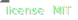
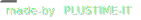

# Laravel EasyForms

- > [Documentation](https://plustimeit.github.io/Laravel-EasyForms/)
- > [Packagist](https://packagist.org/packages/plustime-it/laravel-easyforms)

## Note

This package is considered the parent package. All development that covers both packages will be posted here.

## In Progress

The below features are currently in dev / testing phase and may has issues:

- Password Strength Bar - Customisation of Linear Progress and Requirements Dialog
- Styling and customisation to form title

## Laravel Vue EasyForms

- > [Documentation](https://plustimeit.github.io/Laravel-Vue-EasyForms/#/)
- > [Npm](https://www.npmjs.com/package/laravel-vue-easyforms)

## To Do

More unit and feature tests for backend package
